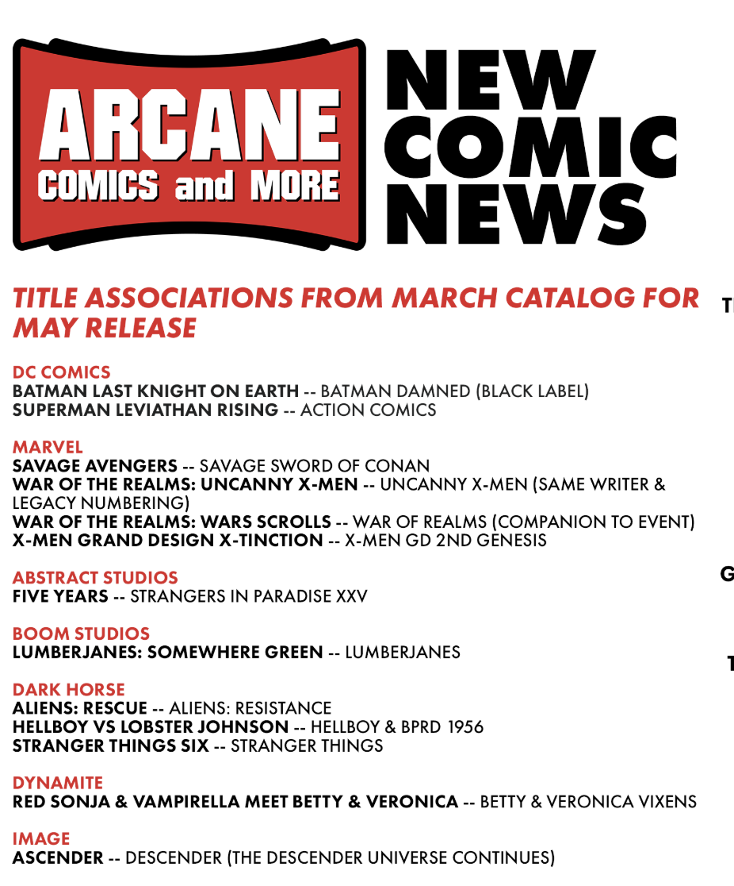

# comics_rx

## Comic Book Recommendation System

**Goal:** Build a recommendation system to 'prescribe' comics to read/buy/subscribe.

**Presentation:** Please refer to this [slide deck](https://docs.google.com/presentation/d/1I1N9p6XaRbnZW_KZ2iPV5GLO24fWA4dYbxSA9FdtPzA/edit#slide=id.g4dfce81f19_0_45) for an overview of the project.

---
### Business Understanding
I subscribe to comic books at a fanastic local comic shop, [Arcane Comic & More](https://www.arcanecomicbooks.com/), and one of the many awesome services they provide is something they call ‘associations’. These associations are intended to match customers to new titles (e.g. new comic books to be released in the near future) that they may be interested. If you opt-in to assocations, you will be automatically subscribed to these associated titles.

**For example: 

In the example above “Savage Avengers” is being recommended to those who subscribe to “Savage Sword of Conan”.

After discussing it with the shop manager, it turns out this process is completely human-driven. Our goal is to build a comic book recommendation system that performs a similar task: to recommend comics titles to a customer (existing and new) based on their current preferences. For current customers this could simply be a replica of their current subscriptions (or more)! For new customers this could be a list of their favorite comic titles.

#### User Story
Henry is a currently a box subscriber at Arcane Comics & More. He has opted-in to Assocations as a way to automatically keep in the loop with new titles on the horizon. The store does a great job for the most part of subscribing him to titles that align with his current reading interests. This is a great value to him because he doesn't have much additional free time to do things like read up on new titles his favorite publishers or writers are developing. He wonders, though,if there is a way to get recommendations on comic books that may have already been published but he hasn't noticed yet.

Bobbie works at the shop. It's incredibly rewarding to use her vast knowledge of all things comics culture to curate the associations list! But she wonders if there is a tool she could use to help further augment the development of recommendations. Is there a way to not only use subscription data, but purchase data as well, to efficiently identify potential comic matches for customers?   

### Data Understanding
With the help of Arcane Comics we obtained a subset of de-identified data of comic books titles sold since they implemented their current point-of-sale system in Feb 2010. While this data has been de-identified of customer information, since it is also relevant to the business activities of a private entity, every effort has been made to limit public exposure of business-sensitive data.

We built an implicit-ratings matrix based on this information. Because buyers at brick-and-mortar stores don’t usually review their books, we proxied their ‘review’ with the fact that they purchased the item. The transaction data provides customer id, date of purchase, and specific issue (e.g. Batman #123). There are some limitations that we will discuss further below.

Once weakness in the data was the inability to easily link sold issues to their specific volumes. This is important because comic books are notorious for being 're-booted' frequently. And each re-boot, may have different create teams, characters, etc. For example, according to [www.comicbookdb.com](http://www.comicbookdb.com/search.php?form_search=Amazing%20Spider-Man&form_searchtype=Title), _The Amazing Spider-Man_ has distinct volumes in both 2015 and 2018.  

### Data Preparation
Since the data originated from a point-of-sale system it was already clean. The primary task was to prune down the data for accounts (i.e. customers) such as:
- Only had a handful of transactions. These are outliers in the sense that they may not be regular comic book consumers and we want to tailor our recommendations to regular customers.
- Had very many transactions. To give sense, the 75th percentile of number of titles bought is 51; but there are customers with 100's of titles bought. We capped the 3 of titles bought in the interest of controlling for outliers.

#### Storage
- We used AWS RDS to store the structured data. 
- We used AWS S3 bucket to store assets for the webapp.

#### Prep
The primary task was getting purchase/review data into the proper form to create an ALS matrix factorization model to be the basis of the recommendation system. The cleaning was as described above, in pruning outliers.

### Modeling
We used ALS matrix factorization method to build the base algorithm via (Py)Spark.

### Evaluation
We used grid search and k-fold cross-validation for parameter searching and tuning. We used RMSE as our error metric.

In addition to 'technical' evaluation, we plan like to test the recommendations with domain experts such as Arcane Comics and other comic enthusiasts.

### Deployment
Our application is a website [www.comics-rx.com](www.comics-rx.com) where a customer can identify 3 of their favorite comics and be offered 1-20 recommendations.

Future enhancement goals inlcude:
- Allow for a more flexible number of favorite comics to be identified to get recommendations (versus a fixed number of inputs).
- Create a method for user to send direct feedback regarding recommendations, e.g. recording user interactions to a database. In lieu of that, contact links are available at the footer of the website.
- Include links in recommendations for users to get synopses of the recommended comic(s).

### Execution
The intial deployment is in form or a web application. In can be found at [http://www.comics-rx.com](http://www.comics-rx.com)!

In order to recreate the project do the following:
#### UNDER CONSTRUCTION

### Future Work

- Specific Volumes  
    - As mentioned above the available data was constrained in the ability to differentiate between different runs of a comic. Factors such as creative groups (writer, artist, etc) can get lost if we are unable to tell series apart. We would like to pursue a way to differentiate the data as such.
- Tastes  
    - We modeled on all data available since 2010. However we did not make any specific adjustments for tastes changing. As an example, a series a customer was into in 2010 may not be relevant to their current tastes; we simply assumed all history was equally important. We would like to further explore this idea, perhaps by limited the time period of the data.
- Modeling  
    - We were also limited in the resources we applied in running our ALS model; we limited ouselves into using a modern laptop to run Spark locally. We would like to explore moving to a resource such as DataBricks or Amazon EMR to potentially explore a larger dataset and wider variety of hyperparameters.
    - We also did not explore any alternative cold start strategies, i.e. We could potentially frame this as a multi-classfication problem using gradient boosting.
- Enhancements  
    - A tool isn't useful it it doesn't meet the user's needs. We are currently gathering feedback from testers, but there are a number of features we consider to be table stakes for this kind of apps that still need to be built.
        - Non-blurry images for comics.
        - Links to resources (e.g. wikis) for recommended comics.
        - A way to save your recommendations.
        - A link to purchase recommended comics.
- Roadmap
    - First iteration we believe would be to incorporate the 'Enhancements' mentioned above.
    - Second, if this app were to be used on the vendor side, it would be most useful it if were to easily ingest customer preferences, e.g. a list of favorite comics or comics they subscribe. As of now all inputs are manual. This would require some sort of API between a vendors POS system and the app.

